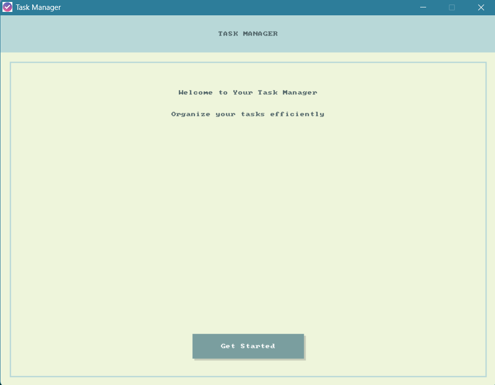
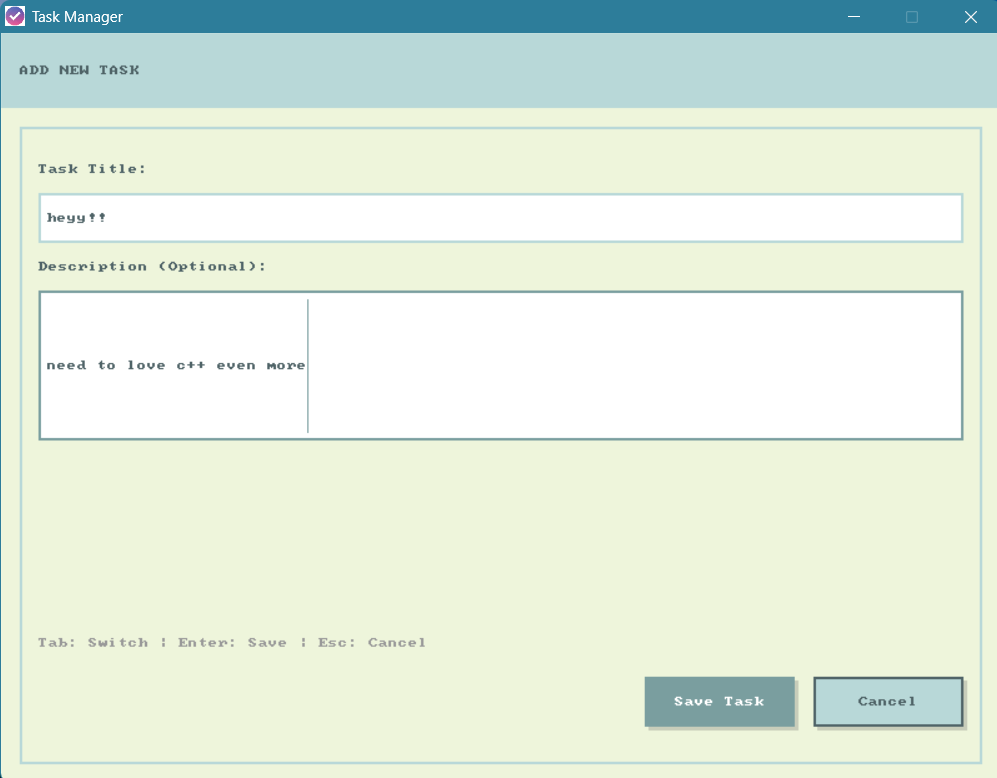
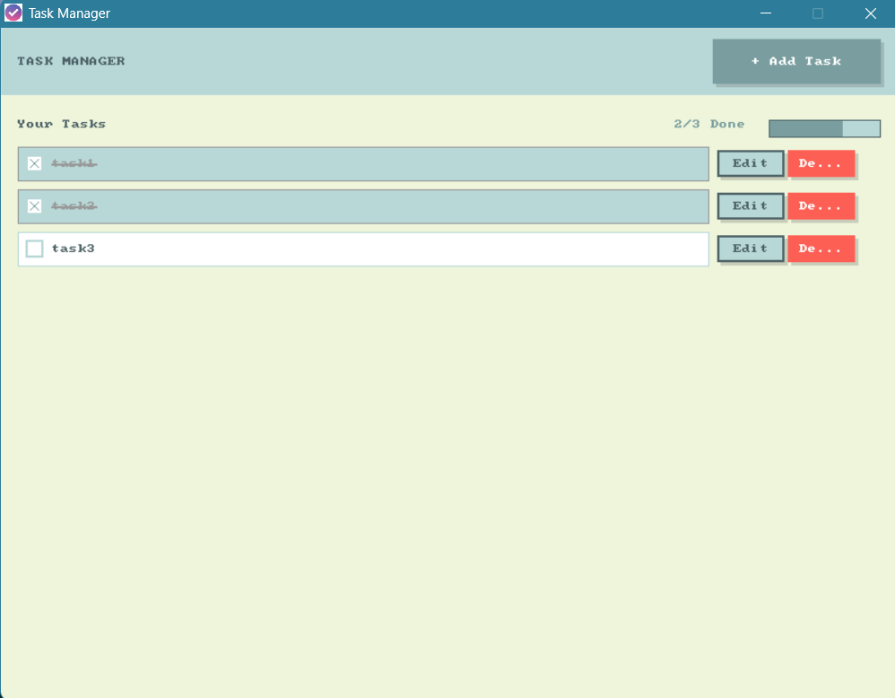

# 📝 To-Do App

A modern, minimal, and beautiful desktop To-Do application built with C++ and SDL2.


## ✨ Features

- **Clean, Compact UI:** Responsive layout, modern color palette, and smooth interactions.
- **Task Management:** Add, edit, delete, and mark tasks as completed.
- **Progress Tracking:** Visual progress bar and stats.
- **Keyboard Shortcuts:** Fast navigation and task entry.
- **Persistent Storage:** Your tasks are saved automatically.
- **Open Source:** MIT Licensed.

## 🚀 Getting Started

### Prerequisites

- **Windows:** MinGW, SDL2 (included)
- **Linux:** g++, [SDL2 development libraries](https://www.libsdl.org/download-2.0.php)

### Build & Run

#### Windows

```sh
mingw32-make clean
mingw32-make
cd bin
TO_DO_APP.exe
```

#### Linux

```sh
sudo apt install g++ libsdl2-dev
make clean
make
cd bin
./TO_DO_APP
```

### Directory Structure

```
assets/         # Images and fonts
bin/            # Compiled executable and DLLs
build/obj/      # Object files
include/        # Header files
src/            # Source code
```

## 🖼️ Screenshots





## 💡 Customization

- Change the color palette in `include/gui.h`.
- Replace `assets/images/logo.bmp` with your own logo.

## 📄 License

This project is licensed under the MIT License. See [LICENSE](LICENSE) for details.

---

> Made with ❤️ in C++ and SDL2. Contributions welcome!
