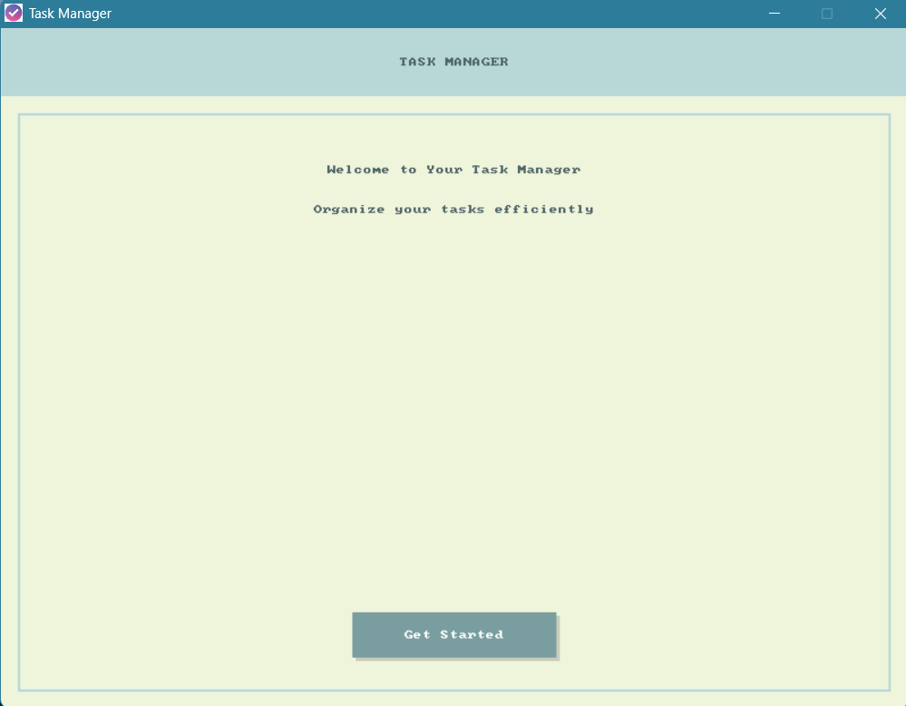
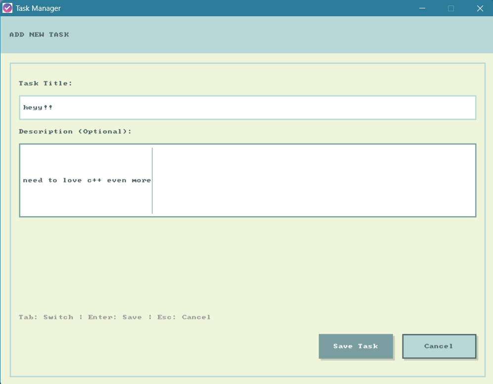
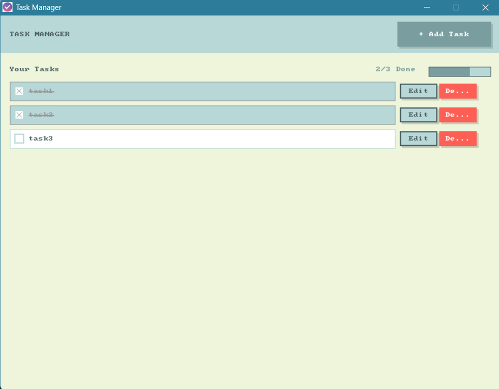

# 📝 To-Do App

A modern, minimal, and beautiful desktop To-Do application built with C++ and SDL2.

## ✨ Features

- Clean, compact, and responsive UI
- Add, edit, delete, and mark tasks as completed
- Visual progress bar and stats
- Fast keyboard navigation
- Tasks are saved automatically (persistent storage)
- Open Source (MIT License)

## 🚀 How to Run (No Setup Required)

1. Download or clone this repository.
2. Open the `bin` folder.
3. Double-click `TO_DO_APP.exe` to launch the app.

> All required files (including SDL2.dll) are included in the `bin` folder. The `dataCenter` folder inside `bin` stores your notes and tasks.

## 🛠️ Building from Source (For Developers)

### Prerequisites

1. Install a C++ compiler (e.g., MinGW or Visual Studio on Windows, g++ on Linux).
2. **Download SDL2 Development Libraries:**
   - Go to [SDL2 Downloads](https://www.libsdl.org/download-2.0.php)
   - Download the development libraries for your platform
   - Extract and copy the header files to the `include/` folder (alongside the existing custom headers)
   - Copy the library files (.lib, .a, .dll) to the `lib/` folder
3. Run `make` (or `mingw32-make` on Windows) in the project root directory.

### Example (Windows)

```sh
# Make sure SDL2 development libraries are in include/ and lib/ folders
# Download from https://www.libsdl.org/download-2.0.php

mingw32-make clean
mingw32-make
cd bin
TO_DO_APP.exe
```

### Example (Linux)

```sh
# Install SDL2 development libraries
sudo apt install g++ libsdl2-dev libsdl2-ttf-dev

# Build the project
make clean
make
cd bin
./TO_DO_APP
```

## 📁 Directory Structure

```
assets/         # Images and fonts
bin/            # Compiled executable, DLLs, and dataCenter folder
include/        # Custom header files (SDL2 headers need to be downloaded separately)
lib/            # SDL2 libraries (need to be downloaded separately for building)
src/            # Source code
```

## 🖼️ Screenshots





## 💡 Customization

- Change the color palette in `include/gui.h`.
- Replace `assets/images/logo.bmp` with your own logo.

## 📄 License

This project is licensed under the MIT License. See [LICENSE](LICENSE) for details.

---

> Made with ❤️ in C++ and SDL2. Contributions welcome!
